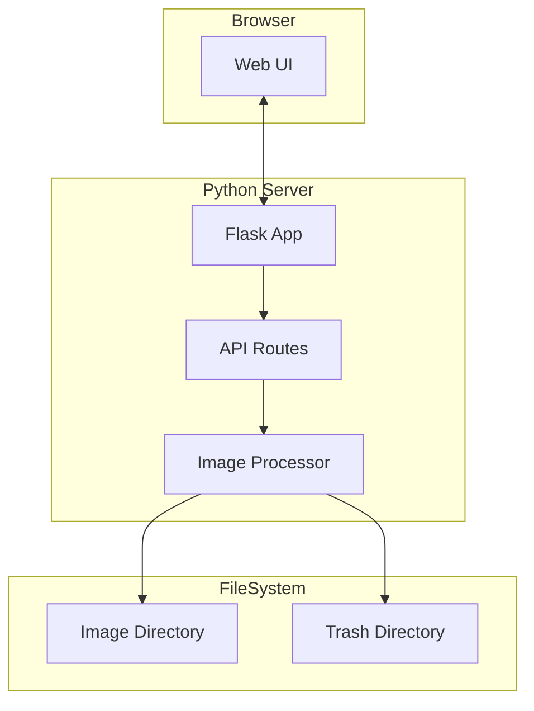

# ImageUnity - Design Document

## Architecture Overview



## Component Design

### 1. Entry Point (`app.py`)

Handles command-line arguments and server startup.

**CLI Arguments:**
| Argument | Default | Description |
|----------|---------|-------------|
| `--dir`, `-d` | Required | Directory containing images |
| `--trash`, `-t` | None | Optional trash directory |
| `--host`, `-H` | `127.0.0.1` | Host to bind (use `0.0.0.0` for all interfaces) |
| `--port`, `-p` | `5000` | Port to listen on |
| `--copy`, `-c` | False | Non-destructive mode: save as copies instead of overwriting |

### 2. Flask Application (`server/`)

**Routes:**

| Endpoint | Method | Description |
|----------|--------|-------------|
| `/` | GET | Serve main HTML page |
| `/api/images` | GET | List all images in directory |
| `/api/image/<filename>` | GET | Serve image file |
| `/api/image/<filename>/info` | GET | Get image dimensions and metadata |
| `/api/image/<filename>/scale` | POST | Scale image to specified size |
| `/api/image/<filename>/crop` | POST | Crop image with specified parameters |
| `/api/image/<filename>/trash` | POST | Move image to trash folder |

### 3. Image Processor (`processor/`)

Core image manipulation using Pillow:

```python
class ImageProcessor:
    def scale(self, image_path, target_size) -> str
    def crop(self, image_path, x, y, width, height) -> str
    def get_info(self, image_path) -> dict
    def move_to_trash(self, image_path, trash_dir) -> bool
```

### 4. Frontend (`static/`, `templates/`)

Single-page application with:
- Image display canvas
- Navigation controls (prev/next, filename display)
- Scaling buttons with preset sizes
- Crop tool with aspect ratio presets
- Interactive crop region selector
- Delete/trash button

## Common Training Sizes

**Scaling Presets:**
| Resolution | Use Case |
|------------|----------|
| 512×512 | SD 1.5 training |
| 768×768 | SDXL training |
| 1024×1024 | SDXL high-quality |

**Aspect Ratio Presets:**
| Ratio | Dimensions (512 base) | Use Case |
|-------|----------------------|----------|
| 1:1 | 512×512, 768×768, 1024×1024 | Square subjects |
| 2:3 | 512×768, 768×1152 | Portrait |
| 3:2 | 768×512, 1152×768 | Landscape |
| 9:16 | 576×1024, 432×768 | Tall portrait |
| 16:9 | 1024×576, 768×432 | Widescreen |

## User Interface Wireframe

```
┌─────────────────────────────────────────────────────────────┐
│  ImageUnity                             [Trash: enabled]    │
├─────────────────────────────────────────────────────────────┤
│                                                             │
│  ┌───────────────────────────────────────────────────────┐  │
│  │                                                       │  │
│  │                                                       │  │
│  │                   [Image Display]                     │  │
│  │                                                       │  │
│  │                                                       │  │
│  └───────────────────────────────────────────────────────┘  │
│                                                             │
│  [◀ Prev]  image_001.jpg (3/25)  [Next ▶]                   │
│                                                             │
├─────────────────────────────────────────────────────────────┤
│  Scale:  [512²] [768²] [1024²]  |  Original: 1920×1080      │
├─────────────────────────────────────────────────────────────┤
│  Crop:   [1:1] [2:3] [3:2] [9:16] [16:9]  [Apply Crop]      │
├─────────────────────────────────────────────────────────────┤
│  [🗑️ Move to Trash]                                         │
└─────────────────────────────────────────────────────────────┘
```

## Crop Interaction Flow

1. User clicks an aspect ratio button
2. System calculates maximum crop area for that ratio
3. A semi-transparent overlay appears over the image
4. User drags the crop region to position it over the subject
5. User clicks "Apply Crop"
6. System saves cropped image and advances to next

## Edit Mode

**Default (Destructive):** Edits overwrite the original file in place.

**Non-Destructive (`--copy` flag):** Saves processed files alongside originals with suffixes:
- Scaled: `image_001_512x512.jpg`
- Cropped: `image_001_crop_1-1.jpg`

## Error Handling

| Scenario | Handling |
|----------|----------|
| Invalid directory | Exit with error message |
| No images found | Show empty state in UI |
| Image read error | Skip image, show error toast |
| Disk full | Show error, abort operation |
| Permission denied | Show error for specific file |

## Security Considerations

- Only serves files from the specified directory (path traversal protection)
- No file upload functionality (read/transform only)
- Binds to localhost by default
- No authentication (intended for local single-user use)
